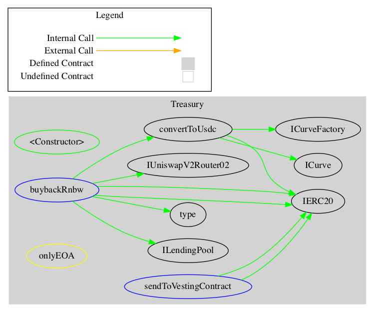
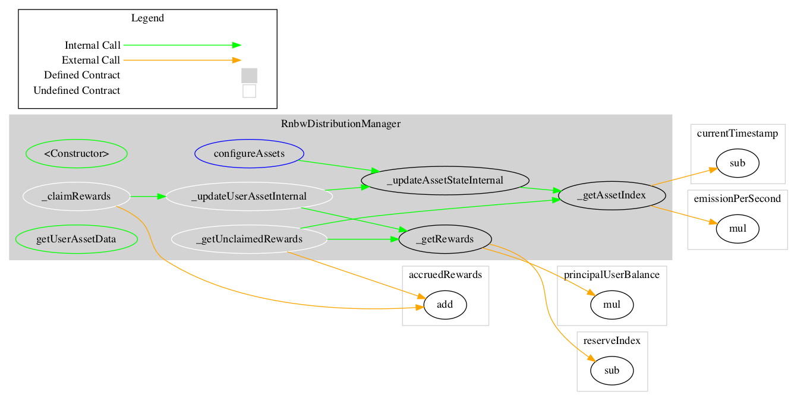
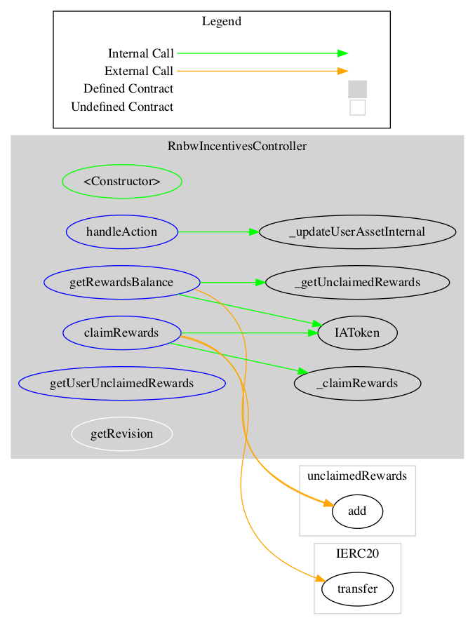

<div id="splash">
    <div id="project">
          <span class="splash-title">
               Project
          </span>
          <br />
          <span id="project-value">
               Lending Market
          </span>
    </div>
     <div id="details">
          <div id="left">
               <span class="splash-title">
                    Client
               </span>
               <br />
               <span class="details-value">
                    HaloDAO
               </span>
               <br />
               <span class="splash-title">
                    Date
               </span>
               <br />
               <span class="details-value">
                    October 2021
               </span>
          </div>
          <div id="right">
               <span class="splash-title">
                    Reviewers
               </span>
               <br />
               <span class="details-value">
                    Andrei Simion
               </span><br />
               <span class="contact">@andreiashu</span>
               <br />
               <span class="details-value">
                    Daniel Luca
               </span><br />
               <span class="contact">@cleanunicorn</span>
          </div>
    </div>
</div>


## Table of Contents
 - [Details](#details)
 - [Issues Summary](#issues-summary)
 - [Executive summary](#executive-summary)
 - [Scope](#scope)
 - [Recommendations](#recommendations)
     - [Increase the number of tests](#increase-the-number-of-tests)
 - [Issues](#issues)
     - [Treasury.buybackRnbw() is vulnerable to price manipulation attacks](#treasurybuybackrnbw-is-vulnerable-to-price-manipulation-attacks)
     - [WETH9 state variable can be made constant to save gas costs](#weth9-state-variable-can-be-made-constant-to-save-gas-costs)
     - [Reuse openzeppelin libraries](#reuse-openzeppelin-libraries)
     - [Unnecessary future deadline value passed to swap functions](#unnecessary-future-deadline-value-passed-to-swap-functions)
     - [Remove obsolete modifier in Treasury contract](#remove-obsolete-modifier-in-treasury-contract)
 - [Artifacts](#artifacts)
     - [Surya](#surya)
 - [Sūrya's Description Report](#suryas-description-report)
     - [Files Description Table](#files-description-table)
     - [Contracts Description Table](#contracts-description-table)
     - [Legend](#legend)
     - [Tests](#tests)
 - [License](#license)


## Details

- **Client** HaloDAO
- **Date** October 2021
- **Lead reviewer** Andrei Simion ([@andreiashu](https://twitter.com/andreiashu))
- **Reviewers** Daniel Luca ([@cleanunicorn](https://twitter.com/cleanunicorn)), Andrei Simion ([@andreiashu](https://twitter.com/andreiashu))
- **Repository**: [Lending Market](git@github.com:HaloDAO/lending-market-v1.git)
- **Commit hash** `01486a398b0aa36b9798ba06fce11b5d3376909d`
- **Technologies**
  - Solidity
  - Typescript

## Issues Summary

| SEVERITY       |    OPEN    |    CLOSED    |
|----------------|:----------:|:------------:|
|  Informational  |  1  |  0  |
|  Minor  |  3  |  0  |
|  Medium  |  1  |  0  |
|  Major  |  0  |  0  |

## Executive summary


This report represents the results of the engagement with **HaloDAO** to review **Lending Market**.

The review is part of a broader engagement with HaloDAO that also includes the [HaloDAO AMM](https://github.com/akiratechhq/review-halo-dao-setcaps-amm-2021-10) component.

The full review was conducted over the course of **2 weeks** from **October 18th to October 29th, 2021**. We spent a total of **15 person-days** reviewing the code.


## Scope

The initial review focused on the [Lending Market](git@github.com:HaloDAO/lending-market-v1.git) repository, identified by the commit hash `01486a398b0aa36b9798ba06fce11b5d3376909d`.

We focused on manually reviewing the codebase, searching for security issues such as, but not limited to, re-entrancy problems, transaction ordering, block timestamp dependency, exception handling, call stack depth limitation, integer overflow/underflow, self-destructible contracts, unsecured balance, use of origin, costly gas patterns, architectural problems, code readability.

**Includes:**

- code/contracts/buyback/Treasury.sol
- code/contracts/buyback/interfaces/ICurve.sol
- code/contracts/buyback/interfaces/ICurveFactory.sol
- code/contracts/buyback/interfaces/IUniswapV2Router01.sol
- code/contracts/buyback/interfaces/IUniswapV2Router02.sol
- code/contracts/incentives/RnbwDistributionManager.sol
- code/contracts/incentives/RnbwIncentivesController.sol
- code/contracts/incentives/VersionedInitializable.sol
- code/contracts/incentives/interfaces/IAToken.sol
- code/contracts/incentives/interfaces/IERC20.sol
- code/contracts/incentives/interfaces/IERC20Detailed.sol
- code/contracts/incentives/interfaces/IRnbwDistributionManager.sol
- code/contracts/incentives/interfaces/IRnbwIncentivesController.sol
- code/contracts/incentives/interfaces/IStakedAave.sol
- code/contracts/incentives/lib/Context.sol
- code/contracts/incentives/lib/DistributionTypes.sol
- code/contracts/incentives/lib/ERC20.sol
- code/contracts/incentives/lib/SafeMath.sol

## Recommendations

We identified a few possible general improvements that are not security issues during the review, which will bring value to the developers and the community reviewing and using the product.

### Increase the number of tests

A good rule of thumb is to have 100% test coverage. This does not guarantee the lack of security problems, but it means that the desired functionality behaves as intended. The negative tests also bring a lot of value because not allowing some actions to happen is also part of the desired behavior.

## Issues


### [`Treasury.buybackRnbw()` is vulnerable to price manipulation attacks](https://github.com/akiratechhq/review-halo-dao-lending-market-2021-10/issues/1)
 

**Description**

The owner of the `Treasury` can call the `buybackRnbw` function to convert one or more of the underlying tokens within a lending pool to `rnbw` tokens:


[code/contracts/buyback/Treasury.sol#L44](https://github.com/akiratechhq/review-halo-dao-lending-market-2021-10/blob/fbfed0a187e9d8df75172a17a83d6cafbb5cbc8a/code/contracts/buyback/Treasury.sol#L44)
```solidity
  function buybackRnbw(address[] calldata _underlyings) external onlyOwner returns (uint256) {
```

The function first uses the cloned DFX protocol to convert the token into USDC:


[code/contracts/buyback/Treasury.sol#L81-L88](https://github.com/akiratechhq/review-halo-dao-lending-market-2021-10/blob/fbfed0a187e9d8df75172a17a83d6cafbb5cbc8a/code/contracts/buyback/Treasury.sol#L81-L88)
```solidity
    uint256 targetAmount =
      ICurve(curveAddress).originSwap(
        _underlying,
        USDC,
        _underlyingAmount,
        0,
        block.timestamp + 60
      );
```

After that the Uniswap V2 protocol is used to convert from USDC to RNBW tokens:


[code/contracts/buyback/Treasury.sol#L59-L69](https://github.com/akiratechhq/review-halo-dao-lending-market-2021-10/blob/fbfed0a187e9d8df75172a17a83d6cafbb5cbc8a/code/contracts/buyback/Treasury.sol#L59-L69)
```solidity
    address[] memory path = new address[](3);
    path[0] = USDC;
    path[1] = WETH9;
    path[2] = rnbw;
    rnbwBought = IUniswapV2Router02(router).swapExactTokensForTokens(
      usdcBalance,
      0,
      path,
      address(this),
      block.timestamp + 60
    )[0];
```

The issue is that in both token swap cases above, the arguments `amountOutMin` (for Uniswap) and `_minTargetAmount` (for DFX Curve contract) are passed as `0` values. This means that the `Treasury` contract does not enforce any minimum amount expected for the output of RNBW tokens swapped. 

The reason why the above two implementations are vulnerable to price manipulation is explained in the Uniswap V2 [**Safety Considerations** section](https://docs.uniswap.org/protocol/V2/guides/smart-contract-integration/trading-from-a-smart-contract):

> Because Ethereum transactions occur in an adversarial environment, smart contracts that do not perform safety checks can be exploited for profit. If a smart contract assumes that the current price on Uniswap is a "fair" price without performing safety checks, it is vulnerable to manipulation. A bad actor could e.g. easily insert transactions before and after the swap (a "sandwich" attack) causing the smart contract to trade at a much worse price, profit from this at the trader's expense, and then return the contracts to their original state. (One important caveat is that these types of attacks are mitigated by trading in extremely liquid pools, and/or at low values.)

**Recommendation**

The best way to protect against these attacks is to use an external price feed or "price oracle". The best "oracle" is simply traders' off-chain observation of the current price, which can be passed into the trade as a safety check.

The `buybackRnbw` function can accept an additional parameter `minRNBWAmount` that can be checked after the two above steps are performed, or passed to the `swapExactTokensForTokens` Uniswap function, to ensure that an expected minimum amount of RNBW tokens were received by the `Treasury` contract.

For example, Uniswap V2 [getAmountsOut](https://docs.uniswap.org/protocol/V2/reference/smart-contracts/library#getamountsout
) can be used by a frontend to calculate a fair value for USDC / RNBW:

> Given an input asset amount and an array of token addresses calculates all subsequent maximum output token amounts by calling getReserves for each pair of token addresses in the path in turn, and using these to call getAmountOut.
> 
> Useful for calculating optimal token amounts before calling swap.

**References**

[Uniswap V2 Documentation: Implement a Swap](https://docs.uniswap.org/protocol/V2/guides/smart-contract-integration/trading-from-a-smart-contract)

[DEFI Sandwich Attack Explaination](https://medium.com/coinmonks/defi-sandwich-attack-explain-776f6f43b2fd)

[Rapid Rise of MEV in Ethereum](https://medium.com/etherscan-blog/rapid-rise-of-mev-in-ethereum-9bcb62e53517)

---


### [WETH9 state variable can be made constant to save gas costs](https://github.com/akiratechhq/review-halo-dao-lending-market-2021-10/issues/6)
 

**Description**

`WETH9` state variable never changes therefore it can be defined as a constant to save gas costs:


[code/contracts/buyback/Treasury.sol#L26](https://github.com/akiratechhq/review-halo-dao-lending-market-2021-10/blob/fbfed0a187e9d8df75172a17a83d6cafbb5cbc8a/code/contracts/buyback/Treasury.sol#L26)
```solidity
  address public WETH9 = 0xC02aaA39b223FE8D0A0e5C4F27eAD9083C756Cc2;
```


---


### [Reuse openzeppelin libraries](https://github.com/akiratechhq/review-halo-dao-lending-market-2021-10/issues/4)
 

**Description**

In most cases the code makes use of the OpenZeppelin's standard libraries:


[code/contracts/buyback/Treasury.sol#L7-L9](https://github.com/akiratechhq/review-halo-dao-lending-market-2021-10/blob/15d777ba6d5690c918bff660532b68887ef23914/code/contracts/buyback/Treasury.sol#L7-L9)
```solidity
import {SafeMath} from '@openzeppelin/contracts/math/SafeMath.sol';
import {Ownable} from '@openzeppelin/contracts/access/Ownable.sol';
import {IERC20} from '@openzeppelin/contracts/token/ERC20/IERC20.sol';
```

In other cases, however, the code uses copy-pasted versions of the same libraries:


[code/contracts/incentives/RnbwIncentivesController.sol#L6-L8](https://github.com/akiratechhq/review-halo-dao-lending-market-2021-10/blob/15d777ba6d5690c918bff660532b68887ef23914/code/contracts/incentives/RnbwIncentivesController.sol#L6-L8)
```solidity
import {SafeMath} from './lib/SafeMath.sol';

import {IERC20} from './interfaces/IERC20.sol';
```

Below we show that there are not functional differences between the `./incentives/lib/Context.sol` file and the one that comes with OpenZeppelin:

```diff
$ diff -uN --ignore-all-space ./incentives/lib/Context.sol ../node_modules/@openzeppelin/contracts/GSN/Context.sol
--- ./incentives/lib/Context.sol        2021-10-22 08:00:48.000000000 +0700
+++ ../node_modules/@openzeppelin/contracts/GSN/Context.sol     2021-10-22 13:39:41.000000000 +0700
@@ -1,10 +1,9 @@
 // SPDX-License-Identifier: MIT
 
-pragma solidity 0.6.12;
+pragma solidity ^0.6.0;
 
-/**
- * @dev From https://github.com/OpenZeppelin/openzeppelin-contracts
- * Provides information about the current execution context, including the
+/*
+ * @dev Provides information about the current execution context, including the
  * sender of the transaction and its data. While these are generally available
```

`SafeMath.sol` is identical but the diff is bigger because of different code formatting:

```diff
$ diff -uN --ignore-all-space ./incentives/lib/SafeMath.sol ../node_modules/@openzeppelin/contracts/math/SafeMath.sol
--- ./incentives/lib/SafeMath.sol       2021-10-22 08:00:48.000000000 +0700
+++ ../node_modules/@openzeppelin/contracts/math/SafeMath.sol   2021-10-22 13:39:41.000000000 +0700
@@ -1,9 +1,9 @@
-// SPDX-License-Identifier: agpl-3.0
-pragma solidity 0.6.12;
+// SPDX-License-Identifier: MIT
+
+pragma solidity ^0.6.0;
 
 /**
- * @dev From https://github.com/OpenZeppelin/openzeppelin-contracts
- * Wrappers over Solidity's arithmetic operations with added overflow
+ * @dev Wrappers over Solidity's arithmetic operations with added overflow
  * checks.
  *
  * Arithmetic operations in Solidity wrap on overflow. This can easily result
@@ -23,11 +23,12 @@
    * Counterpart to Solidity's `+` operator.
    *
    * Requirements:
+     *
    * - Addition cannot overflow.
    */
   function add(uint256 a, uint256 b) internal pure returns (uint256) {
     uint256 c = a + b;
-    require(c >= a, 'SafeMath: addition overflow');
+        require(c >= a, "SafeMath: addition overflow");
 
     return c;
   }
@@ -39,10 +40,11 @@
    * Counterpart to Solidity's `-` operator.
    *
    * Requirements:
+     *
    * - Subtraction cannot overflow.
    */
   function sub(uint256 a, uint256 b) internal pure returns (uint256) {
-    return sub(a, b, 'SafeMath: subtraction overflow');
+        return sub(a, b, "SafeMath: subtraction overflow");
   }
 
   /**
@@ -52,13 +54,10 @@
    * Counterpart to Solidity's `-` operator.
    *
    * Requirements:
+     *
    * - Subtraction cannot overflow.
    */
-  function sub(
-    uint256 a,
-    uint256 b,
-    string memory errorMessage
-  ) internal pure returns (uint256) {
+    function sub(uint256 a, uint256 b, string memory errorMessage) internal pure returns (uint256) {
     require(b <= a, errorMessage);
     uint256 c = a - b;
 
@@ -72,6 +71,7 @@
    * Counterpart to Solidity's `*` operator.
    *
    * Requirements:
+     *
    * - Multiplication cannot overflow.
    */
   function mul(uint256 a, uint256 b) internal pure returns (uint256) {
@@ -83,7 +83,7 @@
     }
 
     uint256 c = a * b;
-    require(c / a == b, 'SafeMath: multiplication overflow');
+        require(c / a == b, "SafeMath: multiplication overflow");
 
     return c;
   }
@@ -97,10 +97,11 @@
    * uses an invalid opcode to revert (consuming all remaining gas).
    *
    * Requirements:
+     *
    * - The divisor cannot be zero.
    */
   function div(uint256 a, uint256 b) internal pure returns (uint256) {
-    return div(a, b, 'SafeMath: division by zero');
+        return div(a, b, "SafeMath: division by zero");
   }
 
   /**
@@ -112,14 +113,10 @@
    * uses an invalid opcode to revert (consuming all remaining gas).
    *
    * Requirements:
+     *
    * - The divisor cannot be zero.
    */
-  function div(
-    uint256 a,
-    uint256 b,
-    string memory errorMessage
-  ) internal pure returns (uint256) {
-    // Solidity only automatically asserts when dividing by 0
+    function div(uint256 a, uint256 b, string memory errorMessage) internal pure returns (uint256) {
     require(b > 0, errorMessage);
     uint256 c = a / b;
     // assert(a == b * c + a % b); // There is no case in which this doesn't hold
@@ -136,10 +133,11 @@
    * invalid opcode to revert (consuming all remaining gas).
    *
    * Requirements:
+     *
    * - The divisor cannot be zero.
    */
   function mod(uint256 a, uint256 b) internal pure returns (uint256) {
-    return mod(a, b, 'SafeMath: modulo by zero');
+        return mod(a, b, "SafeMath: modulo by zero");
   }
 
   /**
@@ -151,13 +149,10 @@
    * invalid opcode to revert (consuming all remaining gas).
    *
    * Requirements:
+     *
    * - The divisor cannot be zero.
    */
-  function mod(
-    uint256 a,
-    uint256 b,
-    string memory errorMessage
-  ) internal pure returns (uint256) {
+    function mod(uint256 a, uint256 b, string memory errorMessage) internal pure returns (uint256) {
     require(b != 0, errorMessage);
     return a % b;
   }
```

**Recommendation**

Remove the following contracts from `./code/contracts/incentives/lib/` folder and make use of the version provided with OpenZeppelin: `Context`, `ERC20`, `MintableErc20`, `SafeMath`.

---


### [Unnecessary future `deadline` value passed to swap functions](https://github.com/akiratechhq/review-halo-dao-lending-market-2021-10/issues/2)
 

**Description**

`Treasury.buybackRnbw()` uses Uniswap V2 to convert underlying tokens into USDC:


[code/contracts/buyback/Treasury.sol#L63-L69](https://github.com/akiratechhq/review-halo-dao-lending-market-2021-10/blob/15d777ba6d5690c918bff660532b68887ef23914/code/contracts/buyback/Treasury.sol#L63-L69)
```solidity
    rnbwBought = IUniswapV2Router02(router).swapExactTokensForTokens(
      usdcBalance,
      0,
      path,
      address(this),
      block.timestamp + 60
    )[0];
```

The `deadline` argument passed to `swapExactTokensForTokens` function is 60 blocks into the future. The deadline parameter is useful for frontend and other off-chain software to ensure there's a deadline after which a swap transaction will revert.

In this case, passing just `block.timestamp` is enough to ensure correct behavior:

Uniswap's `swapExactTokensForTokens` [definition](https://github.com/Uniswap/v2-periphery/blob/dda62473e2da448bc9cb8f4514dadda4aeede5f4/contracts/UniswapV2Router01.sol#L179-L185):

```solidity
    function swapExactTokensForTokens(
        uint amountIn,
        uint amountOutMin,
        address[] calldata path,
        address to,
        uint deadline
    ) external override ensure(deadline) returns (uint[] memory amounts) {
```

Uniswap `ensure` [modifier](https://github.com/Uniswap/v2-periphery/blob/dda62473e2da448bc9cb8f4514dadda4aeede5f4/contracts/UniswapV2Router01.sol#L15-L18):

```solidity
    modifier ensure(uint deadline) {
        require(deadline >= block.timestamp, 'UniswapV2Router: EXPIRED');
        _;
    }
```

**Recommendation**

Instead of `block.timestamp + 60` just pass `block.timestamp` as the deadline argument to `swapExactTokensForTokens` call.

**Notes**

A similar change can be made to the `originSwap` call:


[code/contracts/buyback/Treasury.sol#L81-L88](https://github.com/akiratechhq/review-halo-dao-lending-market-2021-10/blob/15d777ba6d5690c918bff660532b68887ef23914/code/contracts/buyback/Treasury.sol#L81-L88)
```solidity
    uint256 targetAmount =
      ICurve(curveAddress).originSwap(
        _underlying,
        USDC,
        _underlyingAmount,
        0,
        block.timestamp + 60
      );
```

The issue here though is that you still need to add `+1` to the `block.timestamp` because of the way the `deadline` modifier in `Curve.sol` is defined. Because of this, we leave it to the HaloDao team the decision change the call to `originSwap` since there are no (gas) benefits, although it might provide more clarity to the reader:

```solidity
    modifier deadline(uint256 _deadline) {
        require(block.timestamp < _deadline, "Curve/tx-deadline-passed");
        _;
    }
```

---


### [Remove obsolete modifier in `Treasury` contract](https://github.com/akiratechhq/review-halo-dao-lending-market-2021-10/issues/3)
 

**Description**

The `onlyEOA` modifier is obsolete and can be removed:


[code/contracts/buyback/Treasury.sol#L98-L101](https://github.com/akiratechhq/review-halo-dao-lending-market-2021-10/blob/15d777ba6d5690c918bff660532b68887ef23914/code/contracts/buyback/Treasury.sol#L98-L101)
```solidity
  modifier onlyEOA() {
    require(msg.sender == tx.origin, 'Only EOA allowed');
    _;
  }
```


---


## Artifacts

### Surya

Sūrya is a utility tool for smart contract systems. It provides a number of visual outputs and information about the structure of smart contracts. It also supports querying the function call graph in multiple ways to aid in the manual inspection and control flow analysis of contracts.

## Sūrya's Description Report

### Files Description Table


|  File Name  |  SHA-1 Hash  |
|-------------|--------------|
| code/contracts/buyback/Treasury.sol | aabfa1b294af1775a30ad7cc1432aca3adaef48a |
| code/contracts/buyback/interfaces/ICurve.sol | 6709bd40881023198aa153762c2680cf5825c1c5 |
| code/contracts/buyback/interfaces/ICurveFactory.sol | 6818643831d3b11ae062df66ac13478a9e7a458c |
| code/contracts/buyback/interfaces/IUniswapV2Router01.sol | 2acc9e5833363f28ed4da6a17ca9ff5aec263a16 |
| code/contracts/buyback/interfaces/IUniswapV2Router02.sol | c6896849a13dcbff97b81a39a29a6b8aec28d8e8 |
| code/contracts/incentives/RnbwDistributionManager.sol | d7e6fda899a3c2b76edd3f02535b9f8fe1bae20b |
| code/contracts/incentives/RnbwIncentivesController.sol | 4f54f90c53d3c635c7d198b3514040d65b728c0c |
| code/contracts/incentives/VersionedInitializable.sol | 8727598c2af3d69e992d12074c5cb63f77ed0357 |
| code/contracts/incentives/interfaces/IAToken.sol | b973c8ceb01f4b43092435f8a79c7422093351bf |
| code/contracts/incentives/interfaces/IERC20.sol | ecd6d26d76013b7dc7c7c309e651200895d3eba7 |
| code/contracts/incentives/interfaces/IERC20Detailed.sol | 552c23c3ba74003da1d837e52e8c9d2caee8c7a2 |
| code/contracts/incentives/interfaces/IRnbwDistributionManager.sol | b01e2e6b38a815e6a18faf1ba8d4a5cd427995ed |
| code/contracts/incentives/interfaces/IRnbwIncentivesController.sol | 1e27c32483aeb95b80f3d859fc6094c702001cfe |
| code/contracts/incentives/interfaces/IStakedAave.sol | af981d723fa5ab19fb6fc8bfa494283e58d4eddc |
| code/contracts/incentives/lib/Context.sol | ff1e49ddb3ef87789448a17c39e3ee1992ebfad7 |
| code/contracts/incentives/lib/DistributionTypes.sol | 1cf4903d754a79c147c94142915d8c34cc710bf7 |
| code/contracts/incentives/lib/ERC20.sol | 4e48c68a0c7125c0cda79e9c22dd950eb835742a |
| code/contracts/incentives/lib/SafeMath.sol | 6b776dc4a284a7c92f78c37360f8abcf5b8bec72 |
| code/contracts/protocol/tokenization/IncentivizedERC20.sol | 4e0442ef5b1ff0d01e993f67624f397e76fec335 |


### Contracts Description Table


|  Contract  |         Type        |       Bases      |                  |                 |
|:----------:|:-------------------:|:----------------:|:----------------:|:---------------:|
|     └      |  **Function Name**  |  **Visibility**  |  **Mutability**  |  **Modifiers**  |
||||||
| **Treasury** | Implementation | Ownable |||
| └ | <Constructor> | Public ❗️ | 🛑  |NO❗️ |
| └ | buybackRnbw | External ❗️ | 🛑  | onlyOwner |
| └ | convertToUsdc | Internal 🔒 | 🛑  | |
| └ | sendToVestingContract | External ❗️ | 🛑  | onlyOwner |
||||||
| **ICurve** | Interface |  |||
| └ | originSwap | External ❗️ | 🛑  |NO❗️ |
||||||
| **ICurveFactory** | Interface |  |||
| └ | getCurve | External ❗️ |   |NO❗️ |
||||||
| **IUniswapV2Router01** | Interface |  |||
| └ | factory | External ❗️ |   |NO❗️ |
| └ | WETH | External ❗️ |   |NO❗️ |
| └ | addLiquidity | External ❗️ | 🛑  |NO❗️ |
| └ | addLiquidityETH | External ❗️ |  💵 |NO❗️ |
| └ | removeLiquidity | External ❗️ | 🛑  |NO❗️ |
| └ | removeLiquidityETH | External ❗️ | 🛑  |NO❗️ |
| └ | removeLiquidityWithPermit | External ❗️ | 🛑  |NO❗️ |
| └ | removeLiquidityETHWithPermit | External ❗️ | 🛑  |NO❗️ |
| └ | swapExactTokensForTokens | External ❗️ | 🛑  |NO❗️ |
| └ | swapTokensForExactTokens | External ❗️ | 🛑  |NO❗️ |
| └ | swapExactETHForTokens | External ❗️ |  💵 |NO❗️ |
| └ | swapTokensForExactETH | External ❗️ | 🛑  |NO❗️ |
| └ | swapExactTokensForETH | External ❗️ | 🛑  |NO❗️ |
| └ | swapETHForExactTokens | External ❗️ |  💵 |NO❗️ |
| └ | quote | External ❗️ |   |NO❗️ |
| └ | getAmountOut | External ❗️ |   |NO❗️ |
| └ | getAmountIn | External ❗️ |   |NO❗️ |
| └ | getAmountsOut | External ❗️ |   |NO❗️ |
| └ | getAmountsIn | External ❗️ |   |NO❗️ |
||||||
| **IUniswapV2Router02** | Interface | IUniswapV2Router01 |||
| └ | removeLiquidityETHSupportingFeeOnTransferTokens | External ❗️ | 🛑  |NO❗️ |
| └ | removeLiquidityETHWithPermitSupportingFeeOnTransferTokens | External ❗️ | 🛑  |NO❗️ |
| └ | swapExactTokensForTokensSupportingFeeOnTransferTokens | External ❗️ | 🛑  |NO❗️ |
| └ | swapExactETHForTokensSupportingFeeOnTransferTokens | External ❗️ |  💵 |NO❗️ |
| └ | swapExactTokensForETHSupportingFeeOnTransferTokens | External ❗️ | 🛑  |NO❗️ |
||||||
| **RnbwDistributionManager** | Implementation | IRnbwDistributionManager |||
| └ | <Constructor> | Public ❗️ | 🛑  |NO❗️ |
| └ | configureAssets | External ❗️ | 🛑  |NO❗️ |
| └ | _updateAssetStateInternal | Internal 🔒 | 🛑  | |
| └ | _updateUserAssetInternal | Internal 🔒 | 🛑  | |
| └ | _claimRewards | Internal 🔒 | 🛑  | |
| └ | _getUnclaimedRewards | Internal 🔒 |   | |
| └ | _getRewards | Internal 🔒 |   | |
| └ | _getAssetIndex | Internal 🔒 |   | |
| └ | getUserAssetData | Public ❗️ |   |NO❗️ |
||||||
| **RnbwIncentivesController** | Implementation | IRnbwIncentivesController, VersionedInitializable, RnbwDistributionManager |||
| └ | <Constructor> | Public ❗️ | 🛑  | RnbwDistributionManager |
| └ | handleAction | External ❗️ | 🛑  |NO❗️ |
| └ | getRewardsBalance | External ❗️ |   |NO❗️ |
| └ | claimRewards | External ❗️ | 🛑  |NO❗️ |
| └ | getUserUnclaimedRewards | External ❗️ |   |NO❗️ |
| └ | getRevision | Internal 🔒 |   | |
||||||
| **VersionedInitializable** | Implementation |  |||
| └ | getRevision | Internal 🔒 |   | |
||||||
| **IAToken** | Interface |  |||
| └ | getScaledUserBalanceAndSupply | External ❗️ |   |NO❗️ |
||||||
| **IERC20** | Interface |  |||
| └ | totalSupply | External ❗️ |   |NO❗️ |
| └ | balanceOf | External ❗️ |   |NO❗️ |
| └ | transfer | External ❗️ | 🛑  |NO❗️ |
| └ | allowance | External ❗️ |   |NO❗️ |
| └ | approve | External ❗️ | 🛑  |NO❗️ |
| └ | transferFrom | External ❗️ | 🛑  |NO❗️ |
||||||
| **IERC20Detailed** | Interface | IERC20 |||
| └ | name | External ❗️ |   |NO❗️ |
| └ | symbol | External ❗️ |   |NO❗️ |
| └ | decimals | External ❗️ |   |NO❗️ |
||||||
| **IRnbwDistributionManager** | Interface |  |||
| └ | configureAssets | External ❗️ | 🛑  |NO❗️ |
||||||
| **IRnbwIncentivesController** | Interface |  |||
| └ | handleAction | External ❗️ | 🛑  |NO❗️ |
| └ | getRewardsBalance | External ❗️ |   |NO❗️ |
| └ | claimRewards | External ❗️ | 🛑  |NO❗️ |
||||||
| **IStakedAave** | Interface |  |||
| └ | stake | External ❗️ | 🛑  |NO❗️ |
| └ | redeem | External ❗️ | 🛑  |NO❗️ |
| └ | cooldown | External ❗️ | 🛑  |NO❗️ |
| └ | claimRewards | External ❗️ | 🛑  |NO❗️ |
||||||
| **Context** | Implementation |  |||
| └ | _msgSender | Internal 🔒 |   | |
| └ | _msgData | Internal 🔒 |   | |
||||||
| **DistributionTypes** | Library |  |||
||||||
| **ERC20** | Implementation | Context, IERC20, IERC20Detailed |||
| └ | <Constructor> | Public ❗️ | 🛑  |NO❗️ |
| └ | name | Public ❗️ |   |NO❗️ |
| └ | symbol | Public ❗️ |   |NO❗️ |
| └ | decimals | Public ❗️ |   |NO❗️ |
| └ | totalSupply | Public ❗️ |   |NO❗️ |
| └ | balanceOf | Public ❗️ |   |NO❗️ |
| └ | transfer | Public ❗️ | 🛑  |NO❗️ |
| └ | allowance | Public ❗️ |   |NO❗️ |
| └ | approve | Public ❗️ | 🛑  |NO❗️ |
| └ | transferFrom | Public ❗️ | 🛑  |NO❗️ |
| └ | increaseAllowance | Public ❗️ | 🛑  |NO❗️ |
| └ | decreaseAllowance | Public ❗️ | 🛑  |NO❗️ |
| └ | _transfer | Internal 🔒 | 🛑  | |
| └ | _mint | Internal 🔒 | 🛑  | |
| └ | _burn | Internal 🔒 | 🛑  | |
| └ | _approve | Internal 🔒 | 🛑  | |
| └ | _setName | Internal 🔒 | 🛑  | |
| └ | _setSymbol | Internal 🔒 | 🛑  | |
| └ | _setDecimals | Internal 🔒 | 🛑  | |
| └ | _beforeTokenTransfer | Internal 🔒 | 🛑  | |
||||||
| **SafeMath** | Library |  |||
| └ | add | Internal 🔒 |   | |
| └ | sub | Internal 🔒 |   | |
| └ | sub | Internal 🔒 |   | |
| └ | mul | Internal 🔒 |   | |
| └ | div | Internal 🔒 |   | |
| └ | div | Internal 🔒 |   | |
| └ | mod | Internal 🔒 |   | |
| └ | mod | Internal 🔒 |   | |
||||||
| **IncentivizedERC20** | Implementation | Context, IERC20, IERC20Detailed |||
| └ | <Constructor> | Public ❗️ | 🛑  |NO❗️ |
| └ | name | Public ❗️ |   |NO❗️ |
| └ | symbol | Public ❗️ |   |NO❗️ |
| └ | decimals | Public ❗️ |   |NO❗️ |
| └ | totalSupply | Public ❗️ |   |NO❗️ |
| └ | balanceOf | Public ❗️ |   |NO❗️ |
| └ | _getIncentivesController | Internal 🔒 |   | |
| └ | transfer | Public ❗️ | 🛑  |NO❗️ |
| └ | allowance | Public ❗️ |   |NO❗️ |
| └ | approve | Public ❗️ | 🛑  |NO❗️ |
| └ | transferFrom | Public ❗️ | 🛑  |NO❗️ |
| └ | increaseAllowance | Public ❗️ | 🛑  |NO❗️ |
| └ | decreaseAllowance | Public ❗️ | 🛑  |NO❗️ |
| └ | _transfer | Internal 🔒 | 🛑  | |
| └ | _mint | Internal 🔒 | 🛑  | |
| └ | _burn | Internal 🔒 | 🛑  | |
| └ | _approve | Internal 🔒 | 🛑  | |
| └ | _setName | Internal 🔒 | 🛑  | |
| └ | _setSymbol | Internal 🔒 | 🛑  | |
| └ | _setDecimals | Internal 🔒 | 🛑  | |
| └ | _beforeTokenTransfer | Internal 🔒 | 🛑  | |


### Legend

|  Symbol  |  Meaning  |
|:--------:|-----------|
|    🛑    | Function can modify state |
|    💵    | Function is payable |

#### Graphs








#### Describe

```text
$ npx surya describe code/contracts/buyback/Treasury.sol
 +  Treasury (Ownable)
    - [Pub] <Constructor> #
    - [Ext] buybackRnbw #
       - modifiers: onlyOwner
    - [Int] convertToUsdc #
    - [Ext] sendToVestingContract #
       - modifiers: onlyOwner


 ($) = payable function
 # = non-constant function
```

```text
$ npx surya describe code/contracts/incentives/RnbwDistributionManager.sol
 +  RnbwDistributionManager (IRnbwDistributionManager)
    - [Pub] <Constructor> #
    - [Ext] configureAssets #
    - [Int] _updateAssetStateInternal #
    - [Int] _updateUserAssetInternal #
    - [Int] _claimRewards #
    - [Int] _getUnclaimedRewards
    - [Int] _getRewards
    - [Int] _getAssetIndex
    - [Pub] getUserAssetData


 ($) = payable function
 # = non-constant function
```

```text
$ npx surya describe code/contracts/incentives/RnbwIncentivesController.sol
 +  RnbwIncentivesController (IRnbwIncentivesController, VersionedInitializable, RnbwDistributionManager)
    - [Pub] <Constructor> #
       - modifiers: RnbwDistributionManager
    - [Ext] handleAction #
    - [Ext] getRewardsBalance
    - [Ext] claimRewards #
    - [Ext] getUserUnclaimedRewards
    - [Int] getRevision


 ($) = payable function
 # = non-constant function
```


### Tests

```text
npm run testhalo

> @aave/protocol-v2@1.0.1 testhalo
> npm run compile && TS_NODE_TRANSPILE_ONLY=1 hardhat test ./test-suites/test-aave/_*.spec.ts


> @aave/protocol-v2@1.0.1 compile
> SKIP_LOAD=true hardhat compile

Compiling 137 files with 0.6.12
contracts/buyback/interfaces/IUniswapV2Router01.sol: Warning: SPDX license identifier not provided in source file. Before publishing, consider adding a comment containing "SPDX-License-Identifier: <SPDX-License>" to each source file. Use "SPDX-License-Identifier: UNLICENSED" for non-open-source code. Please see https://spdx.org for more information.

contracts/buyback/interfaces/IUniswapV2Router02.sol: Warning: SPDX license identifier not provided in source file. Before publishing, consider adding a comment containing "SPDX-License-Identifier: <SPDX-License>" to each source file. Use "SPDX-License-Identifier: UNLICENSED" for non-open-source code. Please see https://spdx.org for more information.

contracts/buyback/interfaces/IUniswapV2RouterMock.sol: Warning: SPDX license identifier not provided in source file. Before publishing, consider adding a comment containing "SPDX-License-Identifier: <SPDX-License>" to each source file. Use "SPDX-License-Identifier: UNLICENSED" for non-open-source code. Please see https://spdx.org for more information.

contracts/buyback/mocks/UniswapMock.sol: Warning: SPDX license identifier not provided in source file. Before publishing, consider adding a comment containing "SPDX-License-Identifier: <SPDX-License>" to each source file. Use "SPDX-License-Identifier: UNLICENSED" for non-open-source code. Please see https://spdx.org for more information.

contracts/incentives/interfaces/IAToken.sol: Warning: SPDX license identifier not provided in source file. Before publishing, consider adding a comment containing "SPDX-License-Identifier: <SPDX-License>" to each source file. Use "SPDX-License-Identifier: UNLICENSED" for non-open-source code. Please see https://spdx.org for more information.

contracts/protocol/lendingpool/LendingPoolConfigurator.sol:70:25: Warning: This declaration shadows an existing declaration.
  function _initReserve(ILendingPool pool, InitReserveInput calldata input) internal {
                        ^---------------^
contracts/protocol/lendingpool/LendingPoolConfigurator.sol:34:3: The shadowed declaration is here:
  ILendingPool internal pool;
  ^------------------------^

contracts/dependencies/openzeppelin/upgradeability/BaseAdminUpgradeabilityProxy.sol:14:1: Warning: This contract has a payable fallback function, but no receive ether function. Consider adding a receive ether function.
contract BaseAdminUpgradeabilityProxy is BaseUpgradeabilityProxy {
^ (Relevant source part starts here and spans across multiple lines).
contracts/dependencies/openzeppelin/upgradeability/Proxy.sol:16:3: The payable fallback function is defined here.
  fallback() external payable {
  ^ (Relevant source part starts here and spans across multiple lines).

contracts/dependencies/openzeppelin/upgradeability/AdminUpgradeabilityProxy.sol:11:1: Warning: This contract has a payable fallback function, but no receive ether function. Consider adding a receive ether function.
contract AdminUpgradeabilityProxy is BaseAdminUpgradeabilityProxy, UpgradeabilityProxy {
^ (Relevant source part starts here and spans across multiple lines).
contracts/dependencies/openzeppelin/upgradeability/Proxy.sol:16:3: The payable fallback function is defined here.
  fallback() external payable {
  ^ (Relevant source part starts here and spans across multiple lines).

contracts/dependencies/openzeppelin/upgradeability/InitializableUpgradeabilityProxy.sol:11:1: Warning: This contract has a payable fallback function, but no receive ether function. Consider adding a receive ether function.
contract InitializableUpgradeabilityProxy is BaseUpgradeabilityProxy {
^ (Relevant source part starts here and spans across multiple lines).
contracts/dependencies/openzeppelin/upgradeability/Proxy.sol:16:3: The payable fallback function is defined here.
  fallback() external payable {
  ^ (Relevant source part starts here and spans across multiple lines).

contracts/dependencies/openzeppelin/upgradeability/InitializableAdminUpgradeabilityProxy.sol:12:1: Warning: This contract has a payable fallback function, but no receive ether function. Consider adding a receive ether function.
contract InitializableAdminUpgradeabilityProxy is
^ (Relevant source part starts here and spans across multiple lines).
contracts/dependencies/openzeppelin/upgradeability/Proxy.sol:16:3: The payable fallback function is defined here.
  fallback() external payable {
  ^ (Relevant source part starts here and spans across multiple lines).

contracts/protocol/libraries/aave-upgradeability/BaseImmutableAdminUpgradeabilityProxy.sol:16:1: Warning: This contract has a payable fallback function, but no receive ether function. Consider adding a receive ether function.
contract BaseImmutableAdminUpgradeabilityProxy is BaseUpgradeabilityProxy {
^ (Relevant source part starts here and spans across multiple lines).
contracts/dependencies/openzeppelin/upgradeability/Proxy.sol:16:3: The payable fallback function is defined here.
  fallback() external payable {
  ^ (Relevant source part starts here and spans across multiple lines).

contracts/protocol/libraries/aave-upgradeability/InitializableImmutableAdminUpgradeabilityProxy.sol:11:1: Warning: This contract has a payable fallback function, but no receive ether function. Consider adding a receive ether function.
contract InitializableImmutableAdminUpgradeabilityProxy is
^ (Relevant source part starts here and spans across multiple lines).
contracts/dependencies/openzeppelin/upgradeability/Proxy.sol:16:3: The payable fallback function is defined here.
  fallback() external payable {
  ^ (Relevant source part starts here and spans across multiple lines).

contracts/buyback/mocks/CurveMock.sol:38:5: Warning: Unused function parameter. Remove or comment out the variable name to silence this warning.
    address _target,
    ^-------------^

contracts/buyback/mocks/CurveMock.sol:40:5: Warning: Unused function parameter. Remove or comment out the variable name to silence this warning.
    uint256 _minTargetAmount,
    ^----------------------^

contracts/buyback/mocks/CurveMock.sol:41:5: Warning: Unused function parameter. Remove or comment out the variable name to silence this warning.
    uint256 _deadline
    ^---------------^

contracts/buyback/mocks/UniswapMock.sol:18:5: Warning: Unused function parameter. Remove or comment out the variable name to silence this warning.
    uint256 amountOutMin,
    ^------------------^

contracts/buyback/mocks/UniswapMock.sol:20:5: Warning: Unused function parameter. Remove or comment out the variable name to silence this warning.
    address to,
    ^--------^

contracts/buyback/mocks/UniswapMock.sol:21:5: Warning: Unused function parameter. Remove or comment out the variable name to silence this warning.
    uint256 deadline
    ^--------------^

contracts/incentives/RnbwIncentivesController.sol:119:5: Warning: Unused function parameter. Remove or comment out the variable name to silence this warning.
    bool stake
    ^--------^

contracts/mocks/dependencies/weth/WETH9.sol: Warning: SPDX license identifier not provided in source file. Before publishing, consider adding a comment containing "SPDX-License-Identifier: <SPDX-License>" to each source file. Use "SPDX-License-Identifier: UNLICENSED" for non-open-source code. Please see https://spdx.org for more information.

contracts/mocks/oracle/CLAggregators/MockAggregator.sol:18:3: Warning: Function state mutability can be restricted to pure
  function getTokenType() external view returns (uint256) {
  ^ (Relevant source part starts here and spans across multiple lines).

Compilation finished successfully
Creating Typechain artifacts in directory types for target ethers-v5
Successfully generated Typechain artifacts!
Creating Typechain artifacts in directory types for target ethers-v5
Successfully generated Typechain artifacts!

- Enviroment
  - Network : hardhat
-> Deploying test environment...
Deployed mocks
Mock aggs deployed
- Oracle borrow initalization in 1 txs
  - Setted Oracle Borrow Rates for: WETH, DAI, USDC, XSGD, THKD
Initialize configuration
- Skipping init of AAVE due token address is not set at markets config
- Skipping init of BAT due token address is not set at markets config
- Skipping init of BUSD due token address is not set at markets config
Strategy address for asset DAI: 0xBbC60A8fAf66552554e460d55Ac0563Fb9e76c01
Strategy address for asset XSGD: 0xdDD96662ea11dA6F289A5D00da41Ec5F3b67d2b4
Strategy address for asset THKD: 0xdDD96662ea11dA6F289A5D00da41Ec5F3b67d2b4
- Skipping init of ENJ due token address is not set at markets config
- Skipping init of KNC due token address is not set at markets config
- Skipping init of LINK due token address is not set at markets config
- Skipping init of MANA due token address is not set at markets config
- Skipping init of MKR due token address is not set at markets config
- Skipping init of REN due token address is not set at markets config
- Skipping init of SNX due token address is not set at markets config
- Skipping init of SUSD due token address is not set at markets config
- Skipping init of TUSD due token address is not set at markets config
- Skipping init of UNI due token address is not set at markets config
Strategy address for asset USDC: 0xdDD96662ea11dA6F289A5D00da41Ec5F3b67d2b4
- Skipping init of USDT due token address is not set at markets config
- Skipping init of WBTC due token address is not set at markets config
Strategy address for asset WETH: 0xecE50C63d1Ae02Ba306c2b2E1579d0327220196e
- Skipping init of YFI due token address is not set at markets config
- Skipping init of ZRX due token address is not set at markets config
- Skipping init of xSUSHI due token address is not set at markets config
- Reserves initialization in 2 txs
  - Reserve ready for: DAI, XSGD, THKD, USDC
    * gasUsed 7972709
  - Reserve ready for: WETH
    * gasUsed 2039566
- Skipping init of AAVE due token address is not set at markets config
- Skipping init of BAT due token address is not set at markets config
- Skipping init of BUSD due token address is not set at markets config
- Skipping init of ENJ due token address is not set at markets config
- Skipping init of KNC due token address is not set at markets config
- Skipping init of LINK due token address is not set at markets config
- Skipping init of MANA due token address is not set at markets config
- Skipping init of MKR due token address is not set at markets config
- Skipping init of REN due token address is not set at markets config
- Skipping init of SNX due token address is not set at markets config
- Skipping init of SUSD due token address is not set at markets config
- Skipping init of TUSD due token address is not set at markets config
- Skipping init of UNI due token address is not set at markets config
- Skipping init of USDT due token address is not set at markets config
- Skipping init of WBTC due token address is not set at markets config
- Skipping init of YFI due token address is not set at markets config
- Skipping init of ZRX due token address is not set at markets config
- Skipping init of xSUSHI due token address is not set at markets config
- Configure reserves in 1 txs
  - Init for: DAI, XSGD, THKD, USDC, WETH
setup: 6.226s

***************
Setup and snapshot finished
***************

  Fee BuyBack
Rnbw Address: 0xE4C10Db67595aF2Cb4166c8C274e0140f7E43059
0x099d9fF8F818290C8b5B7Db5bFca84CEebd2714c
0x00aD4926D7613c8e00cB6CFa61831D5668265724
BigNumber { _hex: '0x0458fd2d9341', _isBigNumber: true }
BigNumber { _hex: '0x00', _isBigNumber: true }
BigNumber { _hex: '0x00', _isBigNumber: true }
Deployer has rnbw tokens: 10000000000000000000000000
curveMockDaiAddress: 0xe1B3b8F6b298b52bCd15357ED29e65e66a4045fF
Deployer has usdc tokens: 10000000000000000000000000
Uniswap Contract Rnbw balance initial: 10000000000000000000000000
Treasury Contract Rnbw balance initial: 0
Buy back rnbw ...
Treasury Contract Rnbw balance final: 9560502593770
Vesting Contract Rnbw balance initial: 0
Send rnbw to vesting ...
Vesting Contract Rnbw balance final: 9560502593770
    ✓ buyback test

  Incentives Controller
deployer.address: 0xc783df8a850f42e7F7e57013759C285caa701eB6
secondaryWallet.address: 0xeAD9C93b79Ae7C1591b1FB5323BD777E86e150d4
Rnbw Address: 0xE4C10Db67595aF2Cb4166c8C274e0140f7E43059
emissionManager: 0x79dC3dA279A2ADc72210BD00e10951AB9dC70ABc
rnbwIncentivesController: 0xF0B4ACda6D679ea22AC5C4fD1973D0d58eA10ec1
emissionManager rnbwIncentivesController: 0x79dC3dA279A2ADc72210BD00e10951AB9dC70ABc
incentives Controller set on emission manager: 0xF0B4ACda6D679ea22AC5C4fD1973D0d58eA10ec1
incentivesController dai: 1000000000000000000,1635484852,0
incentivesController xsgd: 1000000000000000000,1635484852,0
aDAI balance user after deposit: 2000000000000000000000
0x7c2C195CD6D34B8F845992d380aADB2730bB9C6F
User Unclaimed rewards: 606000000000000000000
User RewardsBalance: 1205999988832760484000
User 2 Unclaimed rewards: 603000000000000000000
User 2 RewardsBalance: 603000000000000000000
    ✓ steak

·----------------------------------------------------------------------------|---------------------------|-------------|-----------------------------·
|                            Solc version: 0.6.12                            ·  Optimizer enabled: true  ·  Runs: 200  ·  Block limit: 12450000 gas  │
·············································································|···························|·············|······························
|  Methods                                                                                                                                           │
·········································|···································|·············|·············|·············|···············|··············
|  Contract                              ·  Method                           ·  Min        ·  Max        ·  Avg        ·  # calls      ·  eur (avg)  │
·········································|···································|·············|·············|·············|···············|··············
|  ATokensAndRatesHelper                 ·  configureReserves                ·          -  ·          -  ·     243281  ·            2  ·          -  │
·········································|···································|·············|·············|·············|···············|··············
|  LendingPool                           ·  borrow                           ·     312133  ·     397054  ·     352671  ·            4  ·          -  │
·········································|···································|·············|·············|·············|···············|··············
|  LendingPool                           ·  deposit                          ·     245995  ·     285665  ·     261744  ·            6  ·          -  │
·········································|···································|·············|·············|·············|···············|··············
|  LendingPool                           ·  setUserUseReserveAsCollateral    ·          -  ·          -  ·      75575  ·            3  ·          -  │
·········································|···································|·············|·············|·············|···············|··············
|  LendingPoolAddressesProvider          ·  setEmergencyAdmin                ·          -  ·          -  ·      47243  ·            2  ·          -  │
·········································|···································|·············|·············|·············|···············|··············
|  LendingPoolAddressesProvider          ·  setLendingPoolCollateralManager  ·          -  ·          -  ·      47176  ·            2  ·          -  │
·········································|···································|·············|·············|·············|···············|··············
|  LendingPoolAddressesProvider          ·  setLendingPoolConfiguratorImpl   ·          -  ·          -  ·     537594  ·            2  ·          -  │
·········································|···································|·············|·············|·············|···············|··············
|  LendingPoolAddressesProvider          ·  setLendingPoolImpl               ·          -  ·          -  ·     578804  ·            2  ·          -  │
·········································|···································|·············|·············|·············|···············|··············
|  LendingPoolAddressesProvider          ·  setLendingRateOracle             ·          -  ·          -  ·      47198  ·            2  ·          -  │
·········································|···································|·············|·············|·············|···············|··············
|  LendingPoolAddressesProvider          ·  setPoolAdmin                     ·      30121  ·      47221  ·      35821  ·            6  ·          -  │
·········································|···································|·············|·············|·············|···············|··············
|  LendingPoolAddressesProvider          ·  setPriceOracle                   ·          -  ·          -  ·      47198  ·            2  ·          -  │
·········································|···································|·············|·············|·············|···············|··············
|  LendingPoolAddressesProviderRegistry  ·  registerAddressesProvider        ·          -  ·          -  ·      91923  ·            2  ·          -  │
·········································|···································|·············|·············|·············|···············|··············
|  LendingPoolConfigurator               ·  batchInitReserve                 ·    2039566  ·    7972709  ·    5006138  ·            4  ·          -  │
·········································|···································|·············|·············|·············|···············|··············
|  LendingRateOracle                     ·  transferOwnership                ·          -  ·          -  ·      28605  ·            2  ·          -  │
·········································|···································|·············|·············|·············|···············|··············
|  MintableERC20                         ·  approve                          ·          -  ·          -  ·      46195  ·            4  ·          -  │
·········································|···································|·············|·············|·············|···············|··············
|  MintableERC20                         ·  mint                             ·          -  ·          -  ·      68102  ·            5  ·          -  │
·········································|···································|·············|·············|·············|···············|··············
|  MintableERC20                         ·  transfer                         ·          -  ·          -  ·      36723  ·            1  ·          -  │
·········································|···································|·············|·············|·············|···············|··············
|  MockEmissionManager                   ·  configure                        ·          -  ·          -  ·      87183  ·            1  ·          -  │
·········································|···································|·············|·············|·············|···············|··············
|  MockEmissionManager                   ·  setIncentivesController          ·          -  ·          -  ·      46153  ·            1  ·          -  │
·········································|···································|·············|·············|·············|···············|··············
|  PriceOracle                           ·  setAssetPrice                    ·      45615  ·      45639  ·      45629  ·           10  ·          -  │
·········································|···································|·············|·············|·············|···············|··············
|  PriceOracle                           ·  setEthUsdPrice                   ·          -  ·          -  ·      44944  ·            2  ·          -  │
·········································|···································|·············|·············|·············|···············|··············
|  RnbwMock                              ·  mint                             ·          -  ·          -  ·      70769  ·            2  ·          -  │
·········································|···································|·············|·············|·············|···············|··············
|  RnbwMock                              ·  transfer                         ·          -  ·          -  ·      36849  ·            2  ·          -  │
·········································|···································|·············|·············|·············|···············|··············
|  StableAndVariableTokensHelper         ·  setOracleBorrowRates             ·          -  ·          -  ·     149397  ·            2  ·          -  │
·········································|···································|·············|·············|·············|···············|··············
|  StableAndVariableTokensHelper         ·  setOracleOwnership               ·          -  ·          -  ·      35516  ·            2  ·          -  │
·········································|···································|·············|·············|·············|···············|··············
|  Treasury                              ·  buybackRnbw                      ·          -  ·          -  ·     358844  ·            1  ·          -  │
·········································|···································|·············|·············|·············|···············|··············
|  Treasury                              ·  sendToVestingContract            ·          -  ·          -  ·      44369  ·            1  ·          -  │
·········································|···································|·············|·············|·············|···············|··············
|  WETHGateway                           ·  authorizeLendingPool             ·          -  ·          -  ·      51538  ·            1  ·          -  │
·········································|···································|·············|·············|·············|···············|··············
|  Deployments                                                               ·                                         ·  % of limit   ·             │
·············································································|·············|·············|·············|···············|··············
|  AaveOracle                                                                ·          -  ·          -  ·     814172  ·        6.5 %  ·          -  │
·············································································|·············|·············|·············|···············|··············
|  AaveProtocolDataProvider                                                  ·          -  ·          -  ·    1555866  ·       12.5 %  ·          -  │
·············································································|·············|·············|·············|···············|··············
|  AToken                                                                    ·          -  ·          -  ·    2325625  ·       18.7 %  ·          -  │
·············································································|·············|·············|·············|···············|··············
|  ATokensAndRatesHelper                                                     ·          -  ·          -  ·    3792708  ·       30.5 %  ·          -  │
·············································································|·············|·············|·············|···············|··············
|  CurveFactoryMock                                                          ·          -  ·          -  ·     179087  ·        1.4 %  ·          -  │
·············································································|·············|·············|·············|···············|··············
|  CurveMock                                                                 ·          -  ·          -  ·     323519  ·        2.6 %  ·          -  │
·············································································|·············|·············|·············|···············|··············
|  DefaultReserveInterestRateStrategy                                        ·          -  ·          -  ·     790705  ·        6.4 %  ·          -  │
·············································································|·············|·············|·············|···············|··············
|  DelegationAwareAToken                                                     ·          -  ·          -  ·    2437054  ·       19.6 %  ·          -  │
·············································································|·············|·············|·············|···············|··············
|  FlashLiquidationAdapter                                                   ·          -  ·          -  ·    2402171  ·       19.3 %  ·          -  │
·············································································|·············|·············|·············|···············|··············
|  GenericLogic                                                              ·          -  ·          -  ·     851914  ·        6.8 %  ·          -  │
·············································································|·············|·············|·············|···············|··············
|  LendingPool                                                               ·          -  ·          -  ·    4797964  ·       38.5 %  ·          -  │
·············································································|·············|·············|·············|···············|··············
|  LendingPoolAddressesProvider                                              ·          -  ·          -  ·    1604832  ·       12.9 %  ·          -  │
·············································································|·············|·············|·············|···············|··············
|  LendingPoolAddressesProviderRegistry                                      ·          -  ·          -  ·     543411  ·        4.4 %  ·          -  │
·············································································|·············|·············|·············|···············|··············
|  LendingPoolCollateralManager                                              ·          -  ·          -  ·    2372785  ·       19.1 %  ·          -  │
·············································································|·············|·············|·············|···············|··············
|  LendingPoolConfigurator                                                   ·          -  ·          -  ·    3484625  ·         28 %  ·          -  │
·············································································|·············|·············|·············|···············|··············
|  LendingRateOracle                                                         ·          -  ·          -  ·     345146  ·        2.8 %  ·          -  │
·············································································|·············|·············|·············|···············|··············
|  MintableERC20                                                             ·     748708  ·     748732  ·     748726  ·          6 %  ·          -  │
·············································································|·············|·············|·············|···············|··············
|  MockAggregator                                                            ·     111522  ·     111546  ·     111539  ·        0.9 %  ·          -  │
·············································································|·············|·············|·············|···············|··············
|  MockEmissionManager                                                       ·          -  ·          -  ·     360267  ·        2.9 %  ·          -  │
·············································································|·············|·············|·············|···············|··············
|  MockFlashLoanReceiver                                                     ·          -  ·          -  ·     590093  ·        4.7 %  ·          -  │
·············································································|·············|·············|·············|···············|··············
|  MockUniswapV2Router02                                                     ·          -  ·          -  ·     819241  ·        6.6 %  ·          -  │
·············································································|·············|·············|·············|···············|··············
|  PriceOracle                                                               ·          -  ·          -  ·     153505  ·        1.2 %  ·          -  │
·············································································|·············|·············|·············|···············|··············
|  ReserveLogic                                                              ·          -  ·          -  ·     176615  ·        1.4 %  ·          -  │
·············································································|·············|·············|·············|···············|··············
|  RnbwIncentivesController                                                  ·          -  ·          -  ·    1143673  ·        9.2 %  ·          -  │
·············································································|·············|·············|·············|···············|··············
|  RnbwMock                                                                  ·          -  ·          -  ·     986100  ·        7.9 %  ·          -  │
·············································································|·············|·············|·············|···············|··············
|  StableAndVariableTokensHelper                                             ·          -  ·          -  ·    3699874  ·       29.7 %  ·          -  │
·············································································|·············|·············|·············|···············|··············
|  StableDebtToken                                                           ·          -  ·          -  ·    1716647  ·       13.8 %  ·          -  │
·············································································|·············|·············|·············|···············|··············
|  Treasury                                                                  ·          -  ·          -  ·     964133  ·        7.7 %  ·          -  │
·············································································|·············|·············|·············|···············|··············
|  UniswapLiquiditySwapAdapter                                               ·          -  ·          -  ·    3053726  ·       24.5 %  ·          -  │
·············································································|·············|·············|·············|···············|··············
|  UniswapMock                                                               ·          -  ·          -  ·     266919  ·        2.1 %  ·          -  │
·············································································|·············|·············|·············|···············|··············
|  UniswapRepayAdapter                                                       ·          -  ·          -  ·    2897716  ·       23.3 %  ·          -  │
·············································································|·············|·············|·············|···············|··············
|  ValidationLogic                                                           ·          -  ·          -  ·    1838521  ·       14.8 %  ·          -  │
·············································································|·············|·············|·············|···············|··············
|  VariableDebtToken                                                         ·          -  ·          -  ·    1421292  ·       11.4 %  ·          -  │
·············································································|·············|·············|·············|···············|··············
|  VestingContractMock                                                       ·          -  ·          -  ·    1135439  ·        9.1 %  ·          -  │
·············································································|·············|·············|·············|···············|··············
|  WalletBalanceProvider                                                     ·          -  ·          -  ·     627128  ·          5 %  ·          -  │
·············································································|·············|·············|·············|···············|··············
|  WETH9Mocked                                                               ·          -  ·          -  ·     538638  ·        4.3 %  ·          -  │
·············································································|·············|·············|·············|···············|··············
|  WETHGateway                                                               ·          -  ·          -  ·    1217607  ·        9.8 %  ·          -  │
·----------------------------------------------------------------------------|-------------|-------------|-------------|---------------|-------------·

  2 passing (19s)

```

## License

This report falls under the terms described in the included [LICENSE](./LICENSE).

<!-- Load highlight.js -->
<link rel="stylesheet"
href="//cdnjs.cloudflare.com/ajax/libs/highlight.js/10.4.1/styles/default.min.css">
<script src="//cdnjs.cloudflare.com/ajax/libs/highlight.js/10.4.1/highlight.min.js"></script>
<script>hljs.initHighlightingOnLoad();</script>
<script type="text/javascript" src="https://cdn.jsdelivr.net/npm/highlightjs-solidity@1.0.20/solidity.min.js"></script>
<script type="text/javascript">
    hljs.registerLanguage('solidity', window.hljsDefineSolidity);
    hljs.initHighlightingOnLoad();
</script>
<link rel="stylesheet" href="./style/print.css"/>
